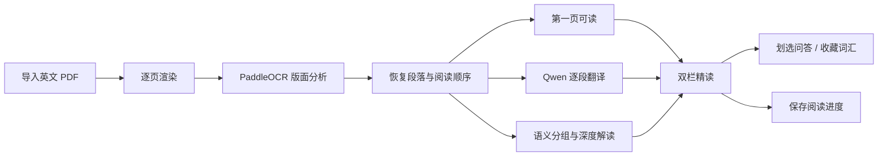

# 论文辅助研读助手

> 把英文论文从“看完翻译”变成“理解论证、追问细节、积累术语”的本地阅读工作台。

论文辅助研读助手是一款面向个人研究与学习的英文论文精读工具。导入 PDF 后，它会自动完成版面解析、段落重建、中文翻译和语义块解读，并把原文、译文、AI 分析、问答证据与个人词汇放在同一个阅读界面中。

项目优先保证两件事：

- **读得顺**：复杂的双栏论文、扫描件、表格和公式也尽量按正确顺序还原，第一页识别完成即可开始阅读；
- **读得深**：AI 不只逐句翻译，还会围绕完整语义块解释论证作用、关键概念、方法选择与可能局限。

所有论文文件、解析结果、阅读进度、词汇和问答记录默认保存在本地。Qwen API Key 只由后端读取，不会返回浏览器。

## 功能一览

| 功能 | 能做什么 |
| --- | --- |
| PDF 结构化解析 | 使用 PaddleOCR PP-StructureV3 统一处理文本型和扫描型 PDF，恢复多栏阅读顺序并识别标题、正文、表格、图注和公式区域 |
| 渐进式阅读 | 逐页 OCR、逐页写入；第一页完成后即可进入阅读器，后续内容在后台持续补全 |
| 双语对照 | 按自然段展示英文原文与中文译文，保留公式、变量、引用编号和图表编号 |
| 语义块深度解读 | 将多个相关自然段组成一个完整语义块，解释其在论文中的作用和逻辑，而不是机械地逐段点评 |
| 论文内 AI 问答 | 可直接对整篇论文提问，也可划选原文、译文或解读后追问；系统自动检索相关段落并附上可跳转的页码证据 |
| 主动词汇收藏 | 划选文字后生成语境释义并收藏，在全文中持续多色高亮；支持掌握状态与个人备注 |
| 阅读现场恢复 | 自动保存阅读百分比和最近段落，再次打开论文时回到上次位置 |
| 本地论文库 | 展示每篇论文的页数、段落数、处理进度和阅读进度；支持去重、失败重试与删除 |
| 学术内容渲染 | 原文、译文和解读统一支持安全 Markdown、GFM 与 KaTeX，不执行模型返回的原始 HTML |

## 核心体验

### 1. 导入后即可开始读

应用会校验 PDF 类型和大小，并通过文件哈希避免重复导入。所有 PDF——无论是否自带文本层——都会进入同一套 PP-StructureV3 流程，避免不同来源的论文出现不一致的版面行为。

解析不是“整篇完成后一次性出现”，而是逐页进行：

1. PDF 页面被渲染并送入 OCR 与版面分析；
2. 页面中的文本块按阅读顺序重建并写入 SQLite；
3. 第一页完成后，前端立即开放阅读；
4. 后续页面、译文和解读每隔数秒自动刷新。

对于 15 页基准论文 *Attention Is All You Need*，在已预热的 4 vCPU / 8 GB CPU 环境中，当前实现约 **5.1 秒可读首屏、90.4 秒完成全文 OCR**。该数据仅用于展示相对性能，实际耗时取决于硬件、网络、页面分辨率和版面复杂度。详细记录见 [性能基准与优化结果](./docs/benchmark.md)。

### 2. 原文、译文与解读对齐

阅读区采用左右对齐布局：

- 左侧按段展示英文原文和中文翻译，并标注页码与段落编号；
- 右侧按语义块展示默认展开的深度 AI 解读；
- 一个解读块可以对应左侧多个连续自然段；
- 鼠标经过任意一侧时，对应内容会联动高亮；
- 点击页码可打开原始 PDF 的对应页面核对。

Qwen 翻译会尽量保留公式、变量、引用编号和图表编号。深度解读则重点说明“这部分为什么出现在这里、承担什么论证作用、关键方法是什么、有哪些局限”，并区分论文明确表达、基于文本的推断和补充背景。

### 3. 基于论文证据继续追问

你可以点击“问 AI”对整篇论文提问，也可以划选任意原文、译文或解读，右键选择“问 AI”。

提问时，后端会组合：

- 当前选中的文字；
- 所在段落及相邻上下文；
- 从全文检索到的相关段落；
- 最近的连续对话记录。

回答会附带引用段落的页码和文本摘要。点击证据即可回到阅读区的对应位置；当论文中没有足够依据时，提示词要求模型明确说明，而不是伪造引用。

### 4. 建立自己的论文词汇表

词汇不会被系统批量自动提取，只有你主动划选并收藏的内容才会进入个人词汇栏。这样可以减少“看起来很多、实际不会复习”的术语噪音。

每条词汇保存：

- 基于当前论文语境生成的中文释义；
- 原始句子与所在页码；
- 全文一致的高亮颜色；
- “陌生 / 学习中 / 已掌握”状态；
- 个人备注。

已收藏词汇会同时高亮在原文、译文和 AI 解读中，帮助你在重复出现的上下文里巩固含义。

### 5. 失败可续跑，结果可复用

OCR、翻译和深度解读的结果都会写入本地数据库。中途遇到 API 限流、网络错误或缺少 Key 时，已经完成的结果不会丢失；配置恢复后点击“重试”，系统会从已有进度继续，不重复执行成功的 OCR 或 AI 任务。

## 工作流程



## 快速开始

### 环境要求

- Python 3.12
- [uv](https://docs.astral.sh/uv/)
- Node.js 20.19+ 或 22.12+
- npm
- 阿里云百炼 DashScope API Key（OCR 不需要；翻译、解读和问答需要）

首次执行 OCR 时，PaddleOCR 会从百度 BOS 下载 PP-StructureV3 所需模型，因此第一次导入会明显慢于后续导入。

### 1. 配置环境变量

复制示例配置：

```powershell
Copy-Item .env.example .env
```

至少填写：

```dotenv
DASHSCOPE_API_KEY=你的百炼Key
```

如果暂时没有 Key，仍然可以完成 OCR 和原文阅读。之后补充 Key、重启后端，再在论文列表中点击“重试”即可继续生成译文与解读。

### 2. 安装并启动后端

```powershell
uv sync --project backend --python 3.12
uv run --project backend uvicorn app.main:app --app-dir backend --reload
```

后端默认运行在 `http://127.0.0.1:8000`，交互式 API 文档位于 `http://127.0.0.1:8000/docs`。

项目固定使用 `paddlepaddle==3.2.2`，用于规避 Windows CPU 环境中 PaddlePaddle 3.3.x 的 oneDNN/PIR 推理兼容问题。请优先使用仓库锁文件中的版本。

### 3. 安装并启动前端

另开一个终端：

```powershell
npm install --prefix frontend
npm run dev --prefix frontend
```

浏览器访问 `http://localhost:5173`，点击“导入 PDF”即可开始。

## 配置说明

常用配置位于项目根目录 `.env`：

| 变量 | 默认值 | 说明 |
| --- | --- | --- |
| `DASHSCOPE_API_KEY` | 空 | 阿里云百炼 API Key |
| `QWEN_BASE_URL` | 北京地域兼容接口 | OpenAI 兼容 API 地址 |
| `QWEN_TRANSLATION_MODEL` | `qwen-mt-flash` | 逐段翻译模型 |
| `QWEN_ANALYSIS_MODEL` | `qwen3.7-max` | 深度解读模型 |
| `QWEN_CHAT_MODEL` | `qwen3.7-max` | 论文问答模型 |
| `QWEN_TRANSLATION_WORKERS` | `3` | 翻译并发工作线程 |
| `QWEN_ANALYSIS_WORKERS` | `3` | 解读并发工作线程 |
| `QWEN_TRANSLATION_RPM` | `55` | 翻译请求启动频率限制 |
| `OCR_DEVICE` | `cpu` | OCR 设备；GPU 环境可改为 `gpu:0` |
| `AUTO_TRANSLATE` | `true` | OCR 后自动生成翻译 |
| `AUTO_ANALYZE` | `true` | OCR 后自动生成深度解读 |
| `DATABASE_URL` | `data/paper_reader.db` | 可选的 SQLite 地址覆盖 |

修改 `.env` 后需要重启后端。完整配置见 [.env.example](./.env.example)。

### GPU 部署

默认环境安装 CPU 版 PaddlePaddle。使用 NVIDIA GPU 的 Linux 服务器时，需要先根据服务器 CUDA 版本安装匹配的 `paddlepaddle-gpu`，再设置：

```dotenv
OCR_DEVICE=gpu:0
```

## Docker 云端部署

仓库提供面向个人使用的单机 Docker Compose 配置：

- Nginx 只对外暴露一个 Web 端口，后端 8000 端口不直接公开；
- 后端固定单进程，避免重复加载体积较大的 Paddle 模型；
- SQLite、原始论文和 Paddle 模型缓存均持久化；
- 服务带健康检查和自动重启；
- 提供本地数据备份脚本。

建议使用 Ubuntu 22.04/24.04、x86_64、至少 4 核 8 GB 内存；PP-StructureV3 在 8 GB 主机上可能使用交换空间，推荐 16 GB 以上内存。

```bash
git clone https://github.com/yuewithme/paper-reading-assistant.git
cd paper-reading-assistant
cp deploy/cloud.env.example .env.cloud
mkdir -p data

# 编辑 .env.cloud，填写服务器地址和 DASHSCOPE_API_KEY。
docker compose --env-file .env.cloud -f compose.cloud.yml up -d --build
docker compose --env-file .env.cloud -f compose.cloud.yml ps
```

默认访问地址为 `http://服务器IP:28473`。安全组只需放行 `PAPER_READER_PORT` 配置的端口，不要开放后端 8000 端口。

当前版本没有内置账号系统。部署到公网时，网页和业务 API 默认可以直接访问；如果论文内容具有隐私性，请在 Nginx 或上层网关增加 HTTPS 和身份认证。

备份本地数据：

```bash
sh deploy/backup.sh
```

## 数据与隐私

默认情况下，以下数据保存在项目根目录的 `data/` 中：

```text
data/
├── paper_reader.db       # 论文元数据、段落、译文、解读、词汇、问答和阅读进度
└── papers/
    └── <paper-id>/
        └── source.pdf    # 原始论文
```

- `.env`、数据库、论文文件和模型缓存均不会提交到 Git；
- 仓库只保留 `.env.example` 作为配置模板；
- DashScope API Key 不会发送给前端；
- 生成翻译、解读或问答时，相应论文文本会发送到所配置的模型服务；
- 在应用中删除论文时，会同时删除该论文的本地数据库记录与文件目录。

## 技术架构

| 层级 | 技术 |
| --- | --- |
| Web 前端 | React 19、TypeScript、Vite |
| 内容渲染 | react-markdown、GFM、KaTeX |
| API 服务 | FastAPI、Pydantic |
| 数据持久化 | SQLAlchemy、SQLite |
| PDF 渲染 | pypdfium2 |
| OCR 与版面分析 | PaddleOCR PP-StructureV3 |
| AI 能力 | Qwen，通过阿里云百炼 OpenAI 兼容接口调用 |
| 部署 | Docker Compose、Nginx |

后端通过统一的 `ParsedDocument` / `DocumentBlock` 数据结构隔离具体 OCR 返回格式，阅读器不直接依赖 PaddleOCR 的原始响应。解析结果会保留页面号、阅读顺序和区域坐标，便于后续做证据定位和版面能力扩展。

## 测试与质量检查

运行后端测试与静态检查：

```powershell
uv run --project backend pytest backend/tests
uv run --project backend ruff check backend
```

运行前端测试与生产构建：

```powershell
npm run test --prefix frontend
npm run build --prefix frontend
```

解析引擎的固定验证矩阵覆盖原生文本、双栏、扫描、公式密集和表格密集五类论文，详见 [解析引擎验证](./docs/parser-validation.md)。

## 已知限制

- 当前主要面向英文论文，翻译方向固定为英文到中文；
- OCR 仍可能在低分辨率扫描、手写内容、极端多栏版式和复杂公式上出错；
- 首次运行需要下载 Paddle 模型，时间和磁盘占用会高于后续运行；
- SQLite 与当前单机部署方案适合个人使用，不面向高并发多用户场景；
- 公网部署默认没有登录门禁，需要自行增加访问控制；
- AI 生成内容可能存在误差，关键结论应回到原文和引用证据核对。

## 项目文档

- [产品开发计划](./产品开发计划.md)
- [开源模块调研](./开源模块调研.md)
- [解析引擎验证](./docs/parser-validation.md)
- [性能基准与优化结果](./docs/benchmark.md)

---

项目当前为 1.0 阶段，已打通“导入 → 解析 → 翻译 → 解读 → 问答 → 词汇 → 进度恢复”的完整个人精读流程。
